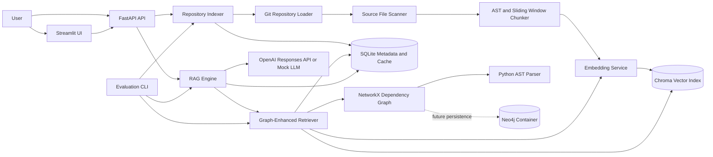

# AI Codebase Engineer

[](https://github.com/hannahtjacob/ai-codebase-engineer/actions/workflows/ci.yml)

AI Codebase Engineer is a backend and search systems project for indexing GitHub
repositories and answering architecture questions with file-and-line citations.
It combines source-aware chunking, vector retrieval, Python dependency graphs,
LLM-based answer generation, persistent caching, and an evaluation harness.

The project is designed to explore the engineering work around code search:
repository ingestion, deterministic identifiers, hybrid retrieval, storage,
API design, observability metrics, and reproducible evaluation.

## Features

- Clones and indexes public GitHub repositories.
- Recursively scans source files while excluding generated and vendor folders.
- Detects common programming languages and skips binary or oversized files.
- Uses Python ASTs to chunk top-level functions, async functions, and classes.
- Falls back to overlapping line windows for non-Python source files.
- Generates OpenAI embeddings in batches, with deterministic local embeddings
  when no API key is configured.
- Stores vectors and source metadata in persistent Chroma collections.
- Builds Python repository graphs with file, import, class, function, method,
  and call relationships.
- Expands vector search results through one-hop imports, calls, and parent
  classes.
- Generates answers constrained to retrieved code and enforces file-and-line
  citations.
- Persists repository metadata, chunks, query history, and JSON cache entries
  in SQLite.
- Caches embeddings by content hash and answers by repository plus normalized
  question.
- Exposes FastAPI endpoints and a Streamlit interface.
- Evaluates Recall@5, Recall@10, citation accuracy, latency, retrieved chunk
  count, and cache hit rate.
- Includes Docker Compose and GitHub Actions support.

## Architecture



The active graph implementation uses NetworkX and rebuilds graphs from indexed
source. Docker Compose also provisions Neo4j as a foundation for future
persistent graph storage.

## Retrieval Flow

1. Embed the user's question.
2. Search Chroma for the highest-ranked chunks within the selected repository.
3. Map seed chunks to dependency-graph nodes.
4. Expand one hop to imported files, called functions, and parent classes.
5. Load related chunks from SQLite and deduplicate by stable chunk ID.
6. Format the ranked context and ask the LLM to answer using only that context.
7. Return the answer with source file paths and line ranges.

## Tech Stack

| Area | Technology |
|---|---|
| API | FastAPI, Pydantic, Uvicorn |
| Frontend | Streamlit |
| Metadata and cache | SQLite, SQLAlchemy |
| Vector search | ChromaDB |
| Embeddings and generation | OpenAI Python SDK |
| Parsing | Python `ast` |
| Dependency graphs | NetworkX |
| Repository operations | GitPython |
| Testing | pytest, FastAPI TestClient |
| Infrastructure | Docker, Docker Compose, GitHub Actions |
| Optional graph service | Neo4j |

## Quickstart

### Docker Compose

Create the environment file:

```bash
cp .env.example .env
```

Add `OPENAI_API_KEY` to `.env` for OpenAI embeddings and generated answers.
Without a key, deterministic embedding and mock-LLM modes allow the pipeline
and tests to run without external API calls.

Start FastAPI, Streamlit, and Neo4j:

```bash
docker compose up --build
```

Open:

- Streamlit: http://localhost:8501
- FastAPI documentation: http://localhost:8000/docs
- Neo4j Browser: http://localhost:7474

Persistent repository clones, SQLite data, and Chroma indexes are stored under
`data/`. Neo4j uses named Docker volumes.

```bash
docker compose down
```

Use `docker compose down -v` only when you also want to remove Neo4j volumes.

### Local Development

Python 3.11 or newer is required.

```bash
python -m venv .venv
source .venv/bin/activate
python -m pip install --upgrade pip
python -m pip install -e ".[test]"
cp .env.example .env
```

Run the backend:

```bash
uvicorn app.main:app --reload
```

Run the frontend in another terminal:

```bash
streamlit run frontend/streamlit_app.py
```

Run tests:

```bash
pytest
```

## Example Questions

- Where is authentication handled?
- How does the API persist indexed repository metadata?
- Which functions call the token-generation service?
- What files participate in the repository indexing flow?
- Where is the database schema defined?
- What would need to change to add OAuth support?
- How are embeddings cached and invalidated?
- Which modules depend on the user model?

## API

### Index a Repository

```bash
curl -X POST http://localhost:8000/repos/index \
  -H "Content-Type: application/json" \
  -d '{"repo_url":"https://github.com/owner/repository"}'
```

Example response:

```json
{
  "repo_id": "abc123",
  "files_scanned": 87,
  "chunks_created": 214,
  "indexing_time_seconds": 12.42
}
```

### Ask a Question

```bash
curl -X POST http://localhost:8000/query \
  -H "Content-Type: application/json" \
  -d '{
    "repo_id": "abc123",
    "question": "How does authentication work?",
    "top_k": 8
  }'
```

Example response:

```json
{
  "answer": "Authentication is handled by the login route and supporting service.",
  "sources": [
    {
      "file_path": "app/auth/routes.py",
      "start_line": 10,
      "end_line": 45,
      "symbol_name": "login_user"
    }
  ]
}
```

### Repository Metadata

```bash
curl http://localhost:8000/repos/abc123
```

### Query History

```bash
curl http://localhost:8000/query/history/abc123
```

### Dependency Graph

```bash
curl http://localhost:8000/graph/abc123
```

The graph response contains typed nodes and directed edges such as `CONTAINS`,
`DEFINES`, `IMPORTS`, and `CALLS`.

## Evaluation

Evaluation cases use JSON Lines:

```json
{"repo_url":"https://github.com/owner/repository","question":"Where is authentication handled?","expected_files":["app/auth/routes.py","app/auth/utils.py"]}
```

Run the evaluation suite:

```bash
python scripts/run_eval.py
```

The evaluator prints a Markdown summary and writes detailed results to
`data/eval/results.json`.

| Metric | Meaning |
|---|---|
| Recall@5 | Fraction of expected files represented in the first five retrieved chunks |
| Recall@10 | Fraction of expected files represented in the first ten retrieved chunks |
| Citation file accuracy | Fraction of cited files that match expected files |
| Average latency | Mean retrieval and answer latency per question |
| Average chunks retrieved | Mean amount of context returned by retrieval |
| Cache hit rate | Cache hits divided by cache lookups during the evaluation run |

The repository does not publish benchmark scores yet; metrics depend on the
evaluation dataset, target repositories, model configuration, and cache state.

## Project Structure

```text
app/
  api/             FastAPI routes and dependencies
  core/            ingestion, retrieval, graph, cache, RAG, and evaluation
  models/          SQLAlchemy and Pydantic models
  prompts/         answer-generation prompts
frontend/          Streamlit application
scripts/           indexing and evaluation CLIs
tests/             unit and integration tests
data/              persisted repositories, indexes, database, and eval data
```

## Engineering Notes

- Stable SHA-256 chunk IDs make re-indexing deterministic.
- Re-indexing replaces stale relational and vector records for a repository.
- Repository-scoped filters prevent vector results from crossing projects.
- OpenAI requests include batching, bounded retries, and exponential backoff.
- SQLite cache entries support JSON values and optional TTL expiration.
- API services are dependency-injectable, allowing tests to avoid network calls.
- CI runs the Python 3.11 test suite on pushes and pull requests.

## Future Improvements

- Persist dependency graphs in Neo4j rather than rebuilding them per request.
- Add incremental indexing based on Git commit and file-content hashes.
- Support richer parsers for TypeScript, Java, Go, and other languages.
- Introduce background jobs for large repository indexing.
- Add authentication, per-user repository ownership, and rate limiting.
- Add reranking and context-budget selection after graph expansion.
- Track model/token cost, index freshness, and retrieval traces.
- Publish a versioned benchmark dataset and baseline evaluation results.
- Add production database migrations and PostgreSQL support.
- Add distributed vector storage, such as Qdrant, for larger deployments.
